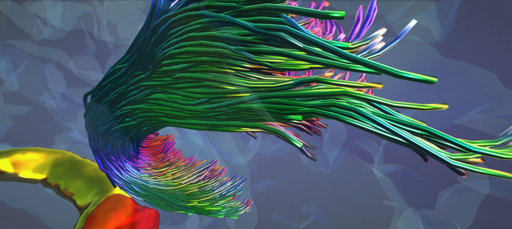

# matlab2glb
 
 
 
 [](https://uk.mathworks.com/matlabcentral/fileexchange/109264-matlab2glb)
 
 Write data from MATLAB to [glb (glTF binary) format](https://www.khronos.org/registry/glTF/specs/2.0/glTF-2.0.html). Focus on objects - scenes/camera not handled.
 
 Objects are MATLAB structures with the following fields:

- indices (if needed): triangle faces array (MATLAB convention, indices from 1 onwards)
- POSITION: vertex coordinates
- any other attributes [as specified](https://www.khronos.org/registry/glTF/specs/2.0/glTF-2.0.html#meshes-overview)

Rows refer to individual elements (e.g., POSITION is an Nx3 array where columns are X,Y,Z and rows are vertices).
Spatial data will get automatically converted to glTF coordinate system.

```
>> brain.indices = F;
>> brain.POSITION = V;
>> brain.COLOR_0 = C;
```

**NB! There may be a need to convert colour data to sRGB for correct visualisation. This is currently being investigated; the user is suggested to use a simple acceptable conversion of `C = C .^ 2.2` in the meantime.**

A separate properties field ('prop') is supplied with each object if desired to specify primitive mode, individual data structures' accessor and component types, and materials. 

[Primitive mode](https://www.khronos.org/registry/glTF/specs/2.0/glTF-2.0.html#meshes-overview) refers to topology type to render (e.g., points, lines, triangles), with triangular mesh being the default. Indices referring to individual modes can be found [here](https://www.khronos.org/registry/glTF/specs/2.0/glTF-2.0.html#schema-reference-mesh-primitive), mode names can alternatively be provided.

```
>> brain.prop.mode = 'Triangles';  % triangular mesh
>> tract.prop.mode = 3;            % line strips
```

With the exception of point clouds, objects that have multiple similar elements (e.g., multiple line strips) should be passed as cell arrays, such that each cell refers to an individual element (e.g., line strip, respectively). Point clouds are passed as a single object.

```
>> disp(numel(tck.data))
        1000
>> disp(class(tck.data))
cell
>> tract.POSITION = tck.data;
```

[Accessor types](https://www.khronos.org/registry/glTF/specs/2.0/glTF-2.0.html#_accessor_type) and [component types](https://www.khronos.org/registry/glTF/specs/2.0/glTF-2.0.html#_accessor_componenttype) are to be supplied within a field of 'prop' with the same name as the data structure it is referring to, as 'type' and 'ctype', respectively. Both will be automatically deducted unless provided. 

```
>> brain.prop.indices.ctype = 5121;
>> brain.prop.indices.type = 'SCALAR';
>> brain.prop.POSITION.ctype = 5126;
>> brain.prop.POSITION.type = 'VEC3';
```

Some support of [materials](https://www.khronos.org/registry/glTF/specs/2.0/glTF-2.0.html#materials) is present. Type gltf_materials to see options - these can be manually added/edited in materials.csv:

```
>> gltf_material

ans =

  8×9 table

    N           name            R       G       B      A      metallicFactor    roughnessFactor    alphaMode 
    _    __________________    ____    ____    ___    ____    ______________    _______________    __________

    1    {'GlassPinkBrain'}       1     0.5    0.5    0.15           0                  1          {'BLEND' }
    2    {'GlassBlueBrain'}     0.3     0.5      1     0.1           0                  1          {'BLEND' }
    3    {'PinkBrain'     }    0.75     0.5    0.5       1         0.5               0.75          {'OPAQUE'}
    4    {'Chrome'        }       1       1      1       1           1                  0          {'OPAQUE'}
    5    {'Gold'          }       1    0.75      0       1           1                0.2          {'OPAQUE'}
    6    {'Ruby'          }     0.6       0      0    0.75         0.5                  0          {'BLEND' }
    7    {'GreenMetal'    }       0       1      0       1           1                0.2          {'OPAQUE'}
    8    {'BlueMetal'     }       0       0      1       1           1                0.2          {'OPAQUE'}
```

Select material by providing its index or name:

```
>> brain.prop.material = gltf_material(1);
% OR
>> brain.prop.material = gltf_material('GlassPinkBrain');
```

Add additional objects either separated by coma or within a cell array:

```
>> tract.COLOR_0 = convert_colourmap(tsf.data, 'cool', [0 1]);
>> write_glb('brain_and_tract.glb', brain, tract);
% OR
>> obj{1} = brain;
>> obj{2} = tract;
>> write_glb('brain_and_tract.glb', obj);
```

Check out the [tract2mesh](https://github.com/dmitrishastin/tract2mesh) converter to transform line strips into smooth tubular meshes!

## Example

Draw a semi-transparent glossy cube with two opposing corners painted red and green:

```
>> example.POSITION = [0 0 0; 1 0 0; 1 1 0; 0 1 0; 0 0 1; 1 0 1; 1 1 1; 0 1 1]; 
>> example.indices = [1 4 2; 4 3 2; 3 7 2; 7 6 2; 3 4 7; 4 8 7; 8 5 7; 5 6 7; 5 2 6; 5 1 2; 1 5 4; 5 8 4];
>> example.COLOR_0 = [1 0 0; 0.5 0.5 0.5; 0.5 0.5 0.5; 0.5 0.5 0.5; 0.5 0.5 0.5; 0.5 0.5 0.5; 0 1 0; 0.5 0.5 0.5];
>> example.prop.material.pbrMetallicRoughness.baseColorFactor = [0.7 0.7 1 0.5];
>> example.prop.material.pbrMetallicRoughness.metallicFactor = 1;
>> example.prop.material.pbrMetallicRoughness.roughnessFactor = 0.1;
>> example.prop.material.alphaMode = 'BLEND';
>> example.prop.material.doubleSided = true;
>> write_glb('example.glb', example);
```

The example can be downloaded [here](example.glb) and viewed [here](https://gltf-viewer.donmccurdy.com/).

## Thanks
[@chamberm](https://github.com/chamberm) and [@LeoSvenningsson](https://github.com/LeoSvenningsson) for testing and feedback!
